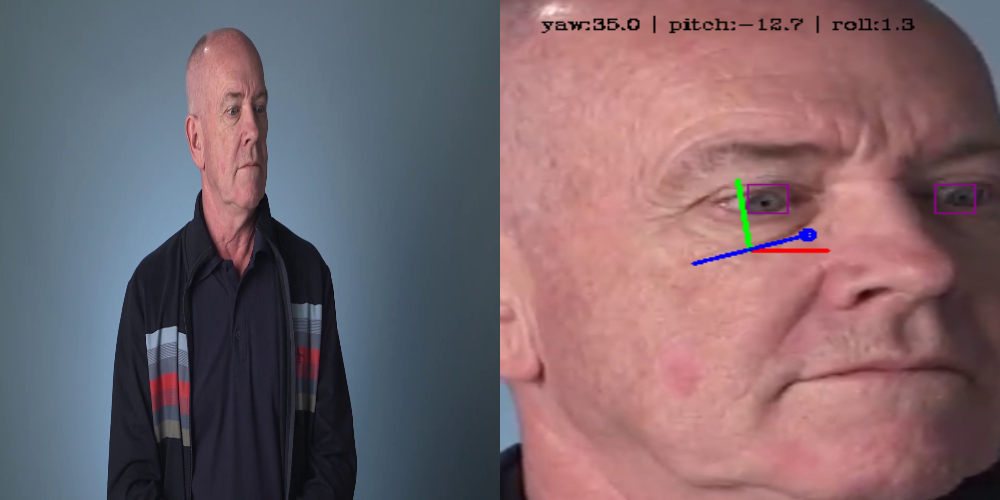
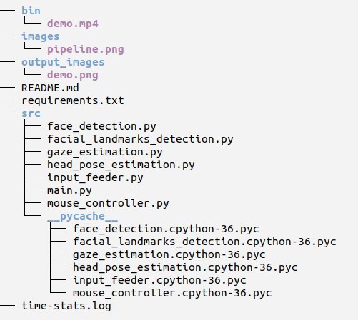

# Computer Pointer Controller

This project is an application that controls the movement of mouse pointer of a computer by movement of the eyes by a video file as an input or through the webcam.

This was achieved through coordinating the flow of data from the input (video or webcam), and then amongst the different models and finally to the mouse controller. The flow of input data through the pipeline is as follow:


### Demo video



## Project Set Up and Installation

### Prerequisite
Download and install the OpenVino Toolkit, the installation guide can be found [here](https://docs.openvinotoolkit.org/latest/index.html)

1. Clone the repository from https://github.com/EmekaEzumezu/computer-pointer-controller.git

2. Change into the working directory and install the dependencies:
   ```
   cd computer-pointer-controller
   pip3 install -r requirements.txt
   ``` 

3. Copy and run the codes to download the required models using OpenVINO model downloader:-

* For face-detection-adas-binary-0001 model:
  ```
   python /opt/intel/openvino/deployment_tools/tools/model_downloader/downloader.py --name "face-detection-adas-binary-0001"
   ``` 
* For head-pose-estimation-adas-0001 model:
  ```
   python /opt/intel/openvino/deployment_tools/tools/model_downloader/downloader.py --name "head-pose-estimation-adas-0001"
   ``` 
* For landmarks-regression-retail-0009 model:
  ```
   python /opt/intel/openvino/deployment_tools/tools/model_downloader/downloader.py --name "landmarks-regression-retail-0009"
   ``` 
* For gaze-estimation-adas-0002 model:
  ```
   python /opt/intel/openvino/deployment_tools/tools/model_downloader/downloader.py --name "gaze-estimation-adas-0002"
   ``` 

## Demo
1. Change into the working directory:
   ```
   cd computer-pointer-controller
   ``` 

2. Run main.py file:-

*  To run CPU:
   ```
   python3 src/main.py -fd intel/face-detection-adas-binary-0001/FP32-INT1/face-detection-adas-binary-0001 \
        -fl intel/landmarks-regression-retail-0009/FP16/landmarks-regression-retail-0009 \
        -hp intel/head-pose-estimation-adas-0001/FP16/head-pose-estimation-adas-0001 \
        -ge intel/gaze-estimation-adas-0002/FP16/gaze-estimation-adas-0002 \
        -i bin/demo.mp4 \
        -d CPU
   ``` 
*  To run GPU:
   ```
   python3 src/main.py -fd intel/face-detection-adas-binary-0001/FP32-INT1/face-detection-adas-binary-0001 \
        -fl intel/landmarks-regression-retail-0009/FP16/landmarks-regression-retail-0009 \
        -hp intel/head-pose-estimation-adas-0001/FP16/head-pose-estimation-adas-0001 \
        -ge intel/gaze-estimation-adas-0002/FP16/gaze-estimation-adas-0002 \
        -i bin/demo.mp4 \
        -d GPU
   ``` 
*  To run FPGA:
   ```
   python3 src/main.py -fd intel/face-detection-adas-binary-0001/FP32-INT1/face-detection-adas-binary-0001 \
        -fl intel/landmarks-regression-retail-0009/FP16/landmarks-regression-retail-0009 \
        -hp intel/head-pose-estimation-adas-0001/FP16/head-pose-estimation-adas-0001 \
        -ge intel/gaze-estimation-adas-0002/FP16/gaze-estimation-adas-0002 \
        -i bin/demo.mp4 \
        -d HETERO:FPGA,CPU
   ``` 

## Documentation

### Links to documentation of the used models
* [Face Detection Model](https://docs.openvinotoolkit.org/latest/_models_intel_face_detection_adas_binary_0001_description_face_detection_adas_binary_0001.html)
* [Head Pose Estimation Model](https://docs.openvinotoolkit.org/latest/_models_intel_head_pose_estimation_adas_0001_description_head_pose_estimation_adas_0001.html)
* [Facial Landmarks Detection Model](https://docs.openvinotoolkit.org/latest/_models_intel_landmarks_regression_retail_0009_description_landmarks_regression_retail_0009.html)
* [Gaze Estimation Model](https://docs.openvinotoolkit.org/latest/_models_intel_gaze_estimation_adas_0002_description_gaze_estimation_adas_0002.html)

### Command line arguments
```
usage: main.py [-h] -fd FDMODEL_LINK -hp HPMODEL_LINK -fl FLMODEL_LINK -ge GEMODEL_LINK -i INPUT_VIDEO/WEBCAM 
	       [-l CPU_EXTENSION] [-d DEVICE] [-pt PROB_THRESHOLD] [-flag PREVIEW_FLAGS]

required arguments:

  -fd, --face_detection: Path to a face detection model xml file with a trained model.

  -hp, --head_pose_estimation: Path to a head pose estimation model xml file with a trained model.

  -fl, --facial_landmarks_detection: Path to a facial landmarks detection model xml file with a trained model.

  -ge, --gaze_estimation: Path to a gaze estimation model xml file with a trained model.

  -i, --input: Path to image or video file

Optional arguments:

  -l, --cpu_extension: MKLDNN (CPU)-targeted custom layers. Absolute path to a shared library with the kernels impl.

  -d, --device: Specify the target device to infer on: CPU, GPU, FPGA or MYRIAD is acceptable. Sample will look for a 			suitable plugin for device specified (CPU by default).

  -pt, --prob_threshold: Probability threshold for detections filtering (0.6 by default).

  -flag, --previewFlags: Specify the flags from fd hp fl ge, like --flag fd hp fl ge (Seperate each flag by space) 
			 for see the visualization of different model outputs of each frame,
			 fd for Face Detection Model, hp for Head Pose Estimation Model, 
			 fl for Facial Landmark Detection Model, ge for Gaze Estimation Model.

```

### Directory structure



- File descriptions:

  * demo.mp4 - An input video.
  * demo.png - An out image
  * face_detection.py - Face detection model class. Loads, process and perform inference on the model.
  * facial_landmarks_detection.py - Facial landmarks detection model class. Loads, process and perform inference on the model.
  * head_pose_estimation.py - Head pose estimation model class. Loads, process and perform inference on the model.
  * gaze_estimation.py - Gaze estimation model class. Loads, process and perform inference on the model.
  * input_feeder.py - Class used to feed input from an image, webcam, or video to the model.
  * main.py - Use to build the inference pipeline and run the main function of the app.
  * mouse_controller.py - Class used to control the mouse pointer.
  * time-stats.log - Log for models load and inference time.


## Benchmarks

### Models load and inference time for CPU

* Load Time:
| Factor/Model | Face Detection   | Landmarks Detetion| Headpose Estimation | Gaze Estimation |
|--------------|------------------|-------------|---------------|-----------|
|    FP32      |  530.0ms         | 76.6ms      | 125.4ms       | 137.0ms   |
|    FP16      |  NA              | 74.3ms      | 108.7ms       | 129.5ms   |  
|    FP32-INT8 |  NA              | 165.0ms     | 773.5ms       | 799.6ms   |

* Inference Time:
| Factor/Model | Face Detection   | Landmarks Detetion | Headpose Estimation | Gaze Estimation |
|--------------|----------------|-----------|-------------|-----------|
|   FP32       | 53.7ms         | 0.9ms     | 3.0ms       | 3.6ms     |
|   FP16       | NA             | 0.9ms     | 2.9ms       | 3.6ms     |
|   FP32-INT8  | NA             | 1.1ms     | 2.7ms       | 3.1ms     |


## Results
* The load time is lesser with higher precision models, like FP32 load time lesser than FP16 load time.
* While the inference time is lesser with lower precision models, FP16 inference time is lesser than that of FP32.

### Edge Cases
* If the app was unable to detect any face as a result of, for instance, lighting changes. It times out and display "Unable to detect any face" and make suggestion to the use to check for poor lighting etc... and retry.

* If there are multiple people in the frame, the app will indicate and provide options, of faces, for the user to select from.

